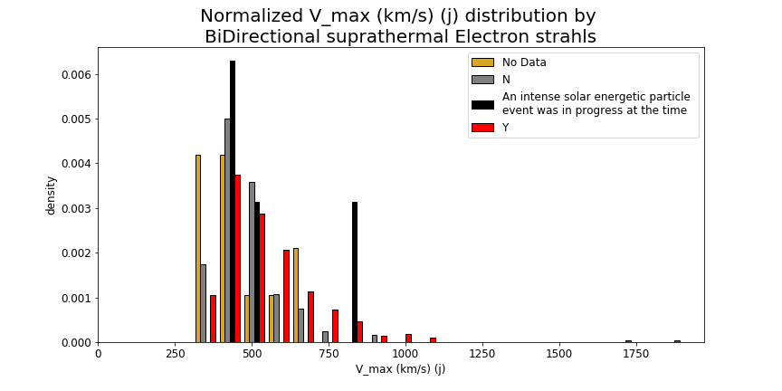

  
  

# Interplanetary Coronal Mass Ejection (ICME) Forcasting - Geomagnetic Storms
 
You may have already heard about the so called carrington event that happen back in 1859. 
The carrington event was such a powerful solar storm that sat the telegraph papers on fire!
The Coronal Mass Ejection (CME) starts on the surface of the sun where the intense magnetic field makes an arc shapes of materials that have a high tendency to snap (wellknown coronal mass ejection).

# Data Scraping

The data was scraped form **Near-Earth Interplanetary Coronal Mass Ejections Since January 1996** webpage [here](http://www.srl.caltech.edu/ACE/ASC/DATA/level3/icmetable2.htm#(k)).

  

Intense solar storms ionize the earth's atmosphere which affects any magnetic communication such as cell phone, internet, etc. 
Such an event has the potential to cause a very large blackout entire planet

  

[image source](https://www.swpc.noaa.gov/phenomena/coronal-mass-ejections)

# EDA

  
  
    
  

# ARIMA 5,1,0 Forecasting results for 18 days ahead.

  
  

