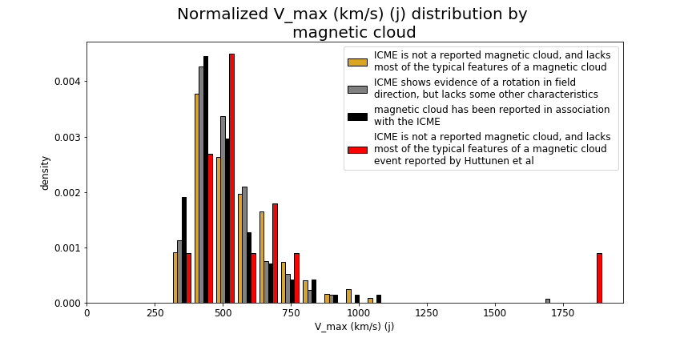
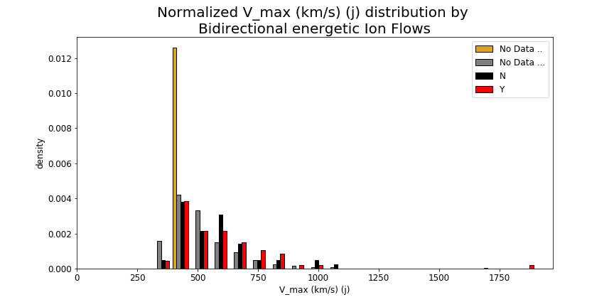

# Interplanetary Coronal Mass Ejection (ICME) Forecasting - Geomagnetic Storms
A big potential threat and a dangerous event that might happen in your lifetime. Geomagnetic storms! On September 1st, 1859, the largest solar storm on record hit the earth.

  
    

You may have already heard about the so called carrington event that happen back in 1859. 
The carrington event was such a powerful solar storm that sat the telegraph papers on fire!
The Coronal Mass Ejection (CME) starts on the surface of the sun where the intense magnetic field makes an arc shapes of materials that have a high tendency to snap (wellknown coronal mass ejection).

A similar event if happen today, it most likely wipes out the whole data on all computers due to the fact they are mostly not electromagnetic pulse protected.

The goal of this project is to forecast the solar storms speed 18 days ahead using classical and modern tools.

## Data Scraping

The data was scraped form **Near-Earth Interplanetary Coronal Mass Ejections Since January 1996** webpage [here](http://www.srl.caltech.edu/ACE/ASC/DATA/level3/icmetable2.htm#(k)).

  

Intense solar storms ionize the earth's atmosphere which affects any magnetic communication such as cell phone, internet, etc. 
Such an event has the potential to cause a very large blackout entire planet

## EDA

  
  
    
  

  

From the above plot, it is observed that the majority of ICME speed falls between 400 to 500 km/s and magnetic activity of -50nT to -60 nT. Note that, the Dst < -100 nT are considered severe solar storms (Zhang et al. 2007).
Although there is some high ICME speed recorded above 450 km/s, however, the data shows both low and high magnetic index disturbance which makes it inconclusive.

At the top- right side of plot, a severe solar strom is seen with ICME speed of around 800 km/s and Dst index of -99.

## Results

### ARIMA 5,1,0 Forecasting for 18 days ahead

  

### AR 150 lags Forecasting for 18 days ahead

  

### LSTM Forecasting for 18 days ahead

  

