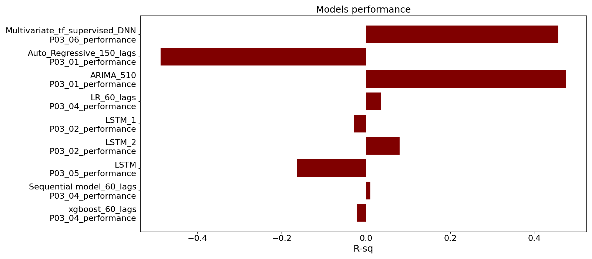

<!--
<p align="left">
    
</p>


-->


<p align="left">
  
</p>

# Interplanetary Coronal Mass Ejection (ICME) Speed Forecasting - Geomagnetic Storms
A big potential threat and a dangerous event that might happen in your lifetime. Geomagnetic storms! On September 1st, 1859, the largest solar storm on record hit the earth. You may have already heard about the so-called Carrington event that happen back in 1859. The Carrington event was such a powerful solar storm that sat the telegraph papers on fire! The Coronal Mass Ejection (CME) starts on the surface of the sun where the intense magnetic field makes an arc shape of materials that have a high tendency to snap (well-known coronal mass ejection). 


## Problem Statment

A similar solar storm like the one in 1859, if happens today most likely wipes out the whole data on all computers due to the fact they are mostly not electromagnetic pulse protected.
Intense solar storms ionize the earth's atmosphere which affects any magnetic communication such as cell phone, internet, etc. 
Such an event has the potential to cause a very large blackout entire planet
The goal of this project is to forecast the solar storm's speed 18 days into the future using classical and modern tools (i.e. using 60 timestamps history). The ICME speed (V ICME km/s) record of the last 30 years is seen in the following figure (Image by author).

<p align="left">
  
</p>


<!--
## Directory Contents

The project directory tree structure is provided below.

```
├───Assets
├───Codes
│   ├───P01_01_Data_Scraping.ipynb
│   ├───P01_02_Data_Scraping.ipynb
│   ├───P02_01_EDA.ipynb
│   ├───P02_02_EDA.ipynb
│   ├───P02_03_EDA.ipynb
│   ├───P02_04_EDA.ipynb
│   ├───P03_01_Univar_ARIMA_AR.ipynb
│   ├───P03_02_Univar_LSTM.ipynb
│   ├───P03_03_Univar_LSTM.ipynb
│   ├───P03_04_Univar_ML.ipynb
│   ├───P03_05_Multivar_LSTM.ipynb
│   ├───P03_06_Multivar_tf_supervised.ipynb
│   ├───P04_01_tf.ipynb
│   ├───P04_02_tf.ipynb
├───Data
├───Figures
├───Models
└───proj
```


## Project Workflow
```
P01 - Data Collection and Cleaning
        1.1 - Data scraping (request and beautifulsoap)
        1.2 - Data scraping (extracting data from HTML source file)
P02 - Data Exploratory
        2.1 - Data cleaning
        The adfuller test shows the pressure data (Univariate - solar wind speed) is STATIONARY 
        - the test stat is less than 10%. Based on adfuller test all data are stationary 
        with 90% confidence.   
        2.2 - more exploratory analysis
        Grouping data for BDE (Evidence of BiDirectional suprathermal Electron strahls), 
        magnetic cloud (MC), Bidirectional energetic Ion Flows (BIF), and quality of the 
        boundary times and aggregate for ICME speed and exploring.
        2.3 - building new df set and turning categorical values into the numerical and 
        save it as JSON file for future steps.
        2.4 - Explore new data set through panda corr function and the potential 
        relation-ship between independent parameters.
P03 - Modeling
        P03_01_Univar_ARIMA_AR
        Data: Data_ICME_Edited_Decoded_out_P02_03 -> evenly distributed 
        lag: three lags were used
        Train_test split: 0.69
        auto arima - > ARIMA (1,1,1) | lag = 1
        ARIMA (5,1,0) | lag = 5
        AR  | lag = 150

        P03_02_Univar_LSTM
        Data: Data_ICME_speed_transformed_18D_P03_01
        lag: 60
        Train_test split: 0.69
        Model: LSTM_1, LSTM_2 (keras)

        P03_04_Univar_ML
        supervised
        Data: Data_ICME_speed_transformed_18D_P03_01
        lag: 60
        Train_test split: 0.69
        ML: XGBoost, LR, Sequential (keras)

        P03_05_Multivar_LSTM
        Data: Data_ICME_Edited_Decoded_out_P02_03
        lag: 60
        Train_test split: 0.69
        Model: LSTM (keras)

        P03_06_Multivar_tf_supervised
        Data: Data_ICME_Edited_Decoded_out_P02_03
        lag: 2
        Train_test split: 0.8
        Model: Squential DNN (tensorflow)
```


-->


## [Data Collection and Preparation](https://github.com/Atashnezhad/ICME_Speed_Forecast/blob/main/Codes/P01_02_Data_Scraping.ipynb)

The data was scraped from **Near-Earth Interplanetary Coronal Mass Ejections Since January 1996** webpage [here](http://www.srl.caltech.edu/ACE/ASC/DATA/level3/icmetable2.htm#(k)).
I searched for the coronal mass ejection data set online and found the near-earth webpage which had the data from 1996 to 2020 (almost 550 rows). The data was a long table on one page with multiple headers, and I needed to use some python libraries that are used commonly in web scraping (i.e. beautiful soap).   
* The data webpage HTML source file was downloaded and saved at the data folder and later was extracted in csv format. The first rows of raw data are seen below.


<p align="left">
  
</p>


## [Exploratory Data Analysis](https://github.com/Atashnezhad/ICME_Speed_Forecast/blob/main/Codes/P02_02_EDA.ipynb)


<p align="left">
  
</p>

It is clear that the events reported by Huttunen et al have reported some outliers in the overall data set. It is seen that the Huttunen et al group have reported some very high ICME speeds. This observation opens room for investigating the whole data reported by their team to discover the reason behind these outliers. is there any difference between the measurement tools used by their team?


<!--
<p align="left">
  
</p>

It is observed that the majority of ICME speed falls between 400 to 500 km/s and magnetic activity of -50nT to -60 nT. Note that, the Dst < -100 nT are considered severe solar storms (Zhang et al. 2007).
Although there is some high ICME speed recorded above 450 km/s, however, the data shows both low and high magnetic index disturbance which makes it inconclusive.
At the top-right side of the plot, a severe solar storm is seen with an ICME speed of around 800 km/s and Dst index of -99. Note that the -99 DsT was assigned to a numerical value of 200 (turning categorical to numerical - the records are availbe in the data folder under the name ```save_coded_values_P02_03_EDA.json```in JSON format)

-->

## [Statistical Analysis Results](https://github.com/Atashnezhad/ICME_Speed_Forecast/blob/main/Statistical_Analysis/Statistical_Analysis.ipynb)


**Average solar wind speed is higher when Bidirectional suprathermal Electron strahls happen compare to when it does not.** 

* I rejected the null hypothesis with ttest_ind from stat librrary with very small p-value, therefore the chance of getting type 1 error (false positive) is pretty low.


**The average solar wind speed when Bidirectional suprathermal Electron strahls happen is not changed compare to when intense solar energetic particle event is happening.** 

* The observed difference in ICME speed is just due to noise. In other word, Although the data shows that when the intense solar energetic particle event is happening the solar wind speed is higher in average compare to when Bidirectional suprathermal Electron strahls is happening, the results However are not statistically significant. Upon checking out the the number of data point with SEP , I found that I do have just 4 rows of data which is not enougth to come up with a solid conclusion about the average ICME speed when intense solar energetic particle event is going on.

**Solar wind speed is higher in average when the forward fast shock happens.** 

* At least I don't have any evidence against it. 


**There is a significant correlation between solar wind speed and the mean magnetic field.** 

* I observed that those cases with the higher mean magnetic fields have generally have higher solar wind speeds and the correlation is statistically significant.


## Solar Speed Forecasting 

Solar Speed Forecasting 18 days into the future. I took two main approaches as follows to forecast the ICME speed.

* Time Series Univariate approach (also I took the supervised approach, applying ML algorithms including XGBoost, sequential, LR)
* Time Series Multivariate approach

**Univariate approach:** The ICME time series data timestamps were not evenly spaced. The data were resampled, considering the mean of timestamps (18 days) into the account. The classical forecasting methods including the autoregressive (AR) and autoregressive integrated moving average (ARIMA) were applied to univariate ICME speed data. I choose the ARIMA model which combines three methods including autoregressive, moving average, and integration. Two LSTM architecture models (Keras) were applied to time series data. In another part (03_04) of this work, the XGBoost, Linear regression, Sequential model using Keras and TensorFlow (data normalized using min-max scaler) were applied for supervised forecasting of univariate ICME speed data.

**Multivariate approach:** I made new data set using the pandas library and the shift method was used along with 60 lags. The goal is to use 60 lags (timestamps) to forecast the future timestamps (18 days into the future). In addition, I applied the LSTM model (Keras) model. The Sequential model using the TensorFlow library was applied considering two lags for ICME speed forecasting. The split fraction of 0.8 improved the model overall estimation MAE (no overfitting observed).


## Model Performance

<p align="left">
  
</p>


<!--
## Results

### ARIMA 5,1,0 

 ARIMA 5,1,0 Forecasting 18 days into the future.

<p align="center">
  
</p>

-->


